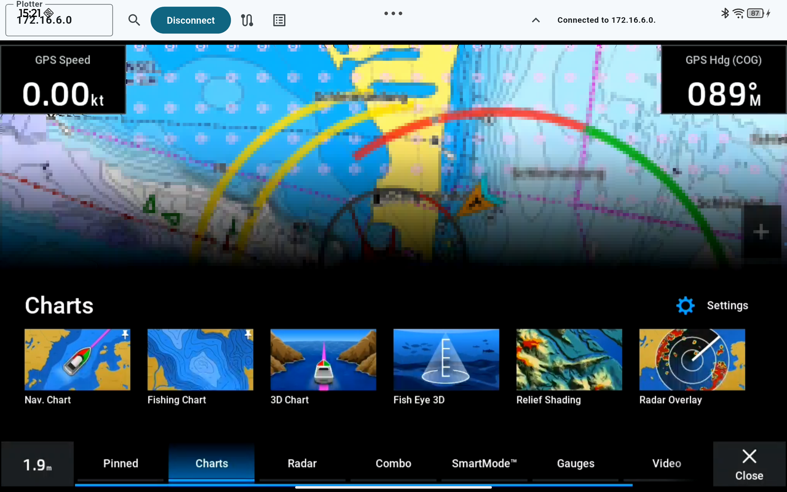

# remote_helm

A cross-platform (Windows, Linux, Android) remote control app for Garmin
chartplotters that support the ActiveCaptain Helm remote — the same
video-plus-touch protocol the official Garmin ActiveCaptain mobile app
uses. Run it full-screen on a tablet mounted at the helm, or windowed on a
laptop at the nav station.

It shows the plotter's live screen (RTSP/H.264 video) and forwards
touch/mouse/scroll input back to it (tap, drag, pinch-to-zoom), so it works
as an alternative touchscreen for the plotter over Wi-Fi.



## Credit

This project is a Flutter/Dart port and continuation of
[Mrkvak/helm-linux](https://github.com/Mrkvak/helm-linux) — a Python
reference implementation for the same protocol, reverse-engineered from
traffic analysis of the ActiveCaptain app.
The wire protocol (`lib/helm/protocol.dart`, `lib/helm/helm_client.dart`)
and pairing flow (`lib/helm/credential.dart`) are ported from that project;
without that prior reverse-engineering work this app wouldn't exist. Like
`helm-linux`, this project is released under the MIT license.

For the full wire protocol — touch/video framing and handshake, pairing,
route sync, and the route/waypoint/track catalog (including the parts this
project reverse-engineered beyond what `helm-linux` covers) — see
[PROTOCOL.md](PROTOCOL.md).

If you only need a Linux desktop client (GTK/GStreamer or mpv-backed, no
Flutter toolchain required), `helm-linux` is a lighter-weight option. This
project exists for cross-platform reach (Windows, Linux, and Android from
one codebase) and a touch-first UI meant to run full-screen on a tablet.

## Features

- **Live video**: the plotter's screen over RTSP/H.264, letterboxed to fit
  the window/screen without cropping.
- **Touch control**: tap, drag, and two-finger pinch-to-zoom map directly
  onto the plotter's screen. Desktop mouse: click-drag + scroll wheel for
  zoom.
- **Discovery & pairing**: finds plotters via mDNS
  (`_garmin-helm._tcp.local`) and handles the one-time pairing handshake
  with the plotter's on-board bl-id service — no manual IP entry required
  (though it's supported as a fallback).
- **Fullscreen on Android**: immersive mode by default, since the point of
  running this on a tablet is to give the video the whole screen. A
  thin edge-tap reveals the connect/discover controls when needed.
- **Windowed on desktop**: normal resizable window by default on
  Windows/Linux, with an explicit fullscreen toggle, so it coexists with
  other windows at a nav station.
- **Screen stays on** while the app is running (wakelock), since a screen
  timing out mid-use at the helm would defeat the point.
- **GPX route import**: pushes a route straight from a `.gpx` file to the
  plotter over its own sync channel — no SD card, no cloud round-trip.
  Supports routes of any point count (see `lib/helm/route_sync.dart`'s doc
  comment for the one remaining known gap).
- **Browse, save, share & delete plotter routes/waypoints**: lists every
  route, waypoint, and saved track stored on the plotter and lets you save
  any of them as a `.gpx` file, share it via the platform share sheet, or
  delete it from the plotter — the reverse direction of the import above,
  over a completely separate channel (see `lib/helm/route_catalog.dart`).
  Confirmed working live end-to-end.
- **Creating/updating waypoints directly on the plotter** (`lib/helm/
  route_catalog.dart`'s `addOrUpdateWaypoint`): work in progress, not yet
  exposed in the UI. The message is sent successfully and matches the
  real app's wire format field-for-field, but hasn't been confirmed to
  durably appear in the plotter's own catalog afterward yet — see that
  method's doc comment for the current status and what's already been
  ruled out.

## Requirements

- A Garmin chartplotter with ActiveCaptain Helm remote support, reachable
  over the same Wi-Fi network as the device running this app.
- The plotter's App Permission (Settings → Communications → Wireless
  Devices/ActiveCaptain, or similar, depending on your plotter's menu
  layout) set to **"View and Control"** — "View only" will pair and show
  video but touch input will silently do nothing.

## Downloads

Prebuilt binaries for all three platforms are published on the
[Releases page](https://github.com/matztam/remote_helm/releases) whenever
a version is tagged. If you'd rather grab the latest build off `master`
without waiting for a tagged release, every push also builds all three
platforms in [Actions](https://github.com/matztam/remote_helm/actions) —
open the newest successful "Build" run and download the platform you want
from its Artifacts section (requires being signed in to GitHub; tagged
Releases don't).

## Building

This is a standard Flutter project targeting Windows, Linux, and Android.

```sh
flutter pub get
flutter run -d linux     # or -d windows, or -d <android-device-id>
```

Release builds:

```sh
flutter build linux --release
flutter build windows --release
flutter build apk --release
```

Windows can't be cross-compiled from Linux/macOS — building it requires an
actual Windows host. This repo's GitHub Actions workflow
(`.github/workflows/build.yml`) builds all three platforms (Linux, Windows,
Android) on their own appropriately-hosted runners on every push, so you
don't need a Windows machine or an Android SDK set up locally just to get
a build — see [Downloads](#downloads) above.

### Android build note

`fvp` (the RTSP-capable video backend, see below) pulls in a `jni` package
version that breaks `flutter build apk` on recent Android Gradle Plugin
versions ("Could not find method kotlin()"). This is worked around with a
`dependency_overrides: jni: ^1.0.2` pin in `pubspec.yaml` — already in
place, no action needed, but worth knowing about if you see that error
after upgrading dependencies.

## Command-line protocol tool

`bin/helm_cli.dart` exercises the protocol layer directly, without the
Flutter GUI — useful for verifying discovery/pairing/session setup against
a real plotter, or for debugging:

```sh
dart run bin/helm_cli.dart discover
dart run bin/helm_cli.dart pair <plotter-ip>
dart run bin/helm_cli.dart helm --host <plotter-ip> --tap 0.5 0.5
```

## How it works

- **Discovery**: mDNS browsing for `_garmin-helm._tcp.local`
  (`lib/helm/discovery.dart`).
- **Pairing**: an HTTP/protobuf handshake with the plotter's `_garmin-bl-
  id._tcp` service registers this device and obtains a role/token
  (`lib/helm/credential.dart`).
- **Touch/control session**: a persistent TCP connection on port 51200
  using a small proprietary binary framing (`[u16 type LE][u16
  0xBEEF][u32 length LE][payload]`), documented and implemented in
  `lib/helm/protocol.dart` and `lib/helm/helm_client.dart`. After the
  initial handshake grants a touch context, the plotter expects ongoing
  activity as a keepalive for the *whole* session — including the
  separate video stream — or it kills everything after ~30s. This client
  replays the same keepalive the real ActiveCaptain app itself uses
  (confirmed via packet capture): a periodic re-subscribe to a few data
  indices every 5 seconds, rather than a synthetic touch frame — the
  latter was tried first and worked, but the plotter tracks touch
  position across the whole session, so a synthetic frame could make the
  next real tap silently register at the wrong spot. See
  `helm_client.dart`'s doc comment for the full story.
- **Video**: the plotter serves H.264 over RTSP on port 554, UDP transport
  only. `video_player` has no RTSP support on its own, so `fvp` (an
  FFmpeg/mdk-based platform implementation) is registered in its place
  (`lib/ui/helm_video_view.dart`).
- **Route sync**: a separate TCP connection (port 50610, same framing as
  the touch/control session) that pushes route/waypoint data to the
  plotter. This channel has no prior public documentation anywhere — it
  was reverse-engineered from a packet capture of the real ActiveCaptain
  app doing a route sync, since neither `helm-linux`'s own protocol notes
  nor any other source covers it. See `lib/helm/route_sync.dart`'s doc
  comment for the full wire format, including the checksum trailer, and
  its one remaining known gap. GPX parsing itself is in
  `lib/helm/gpx.dart`.
- **Route/waypoint catalog, download & delete**: a third, entirely
  different channel (port 50615) from either of the above, with its own
  outer framing (`MSG*` + length, not `0xBEEF`) and its own inner message
  types — used to list what's stored on the plotter, fetch individual
  objects, and delete entries (each reply is gzip-compressed JSON with
  semicircle-encoded coordinates). Also undocumented anywhere prior to
  this project; reverse-engineered the same way, from packet captures of
  the real app syncing a plotter-created route down into ActiveCaptain.
  See `lib/helm/route_catalog.dart`'s doc comment for the full wire
  format and known gaps.

See [PROTOCOL.md](PROTOCOL.md) for the complete wire-format reference
across all of these channels.

## License

MIT — see [LICENSE](LICENSE). Portions of the protocol implementation are
ported from [Mrkvak/helm-linux](https://github.com/Mrkvak/helm-linux),
also MIT-licensed.
